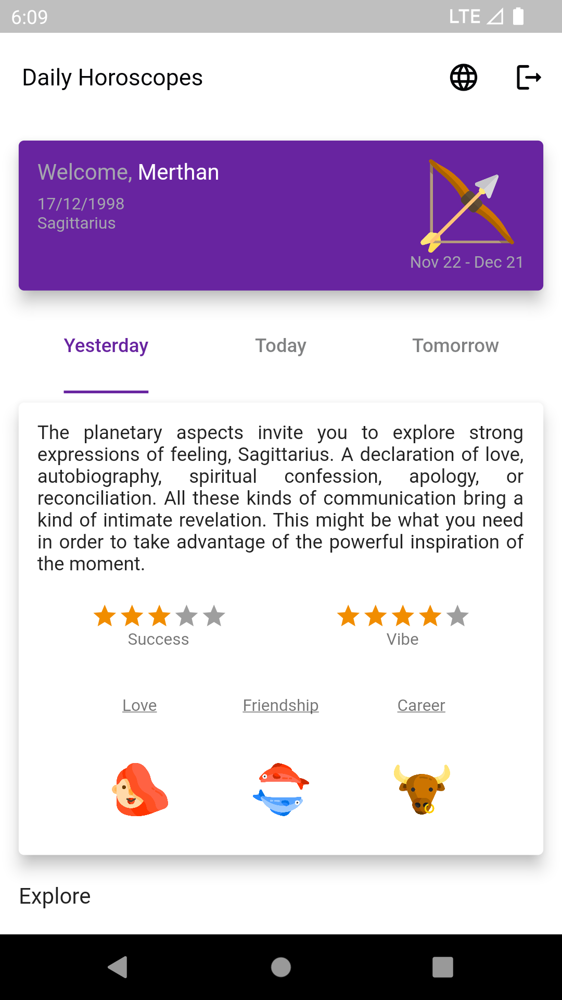
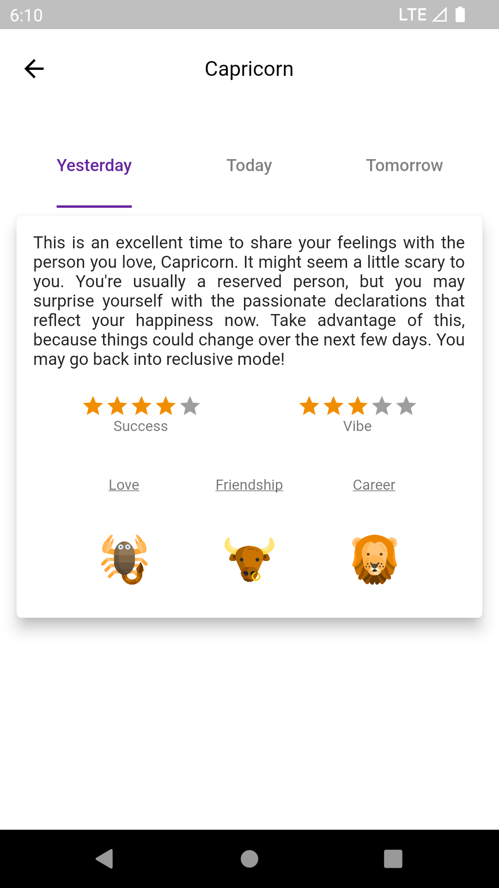

# Daily Horoscopes

It is a flutter application where you can follow daily horoscope information.

<a href="https://play.google.com/store/apps/details?id=com.mkavaktech.dailyhoroscopeapp" target="_blank">
    

## Tech and Libraries

- MVVM Architecture
- State Management with [MobX](https://pub.dev/packages/mobx)
- Navigation with [GoRouter](https://pub.dev/packages/go_router)
- Cache Management with [Hive](https://pub.dev/packages/hive_flutter)
- Network with [Vexana](https://pub.dev/packages/vexana)
- Localization with [EasyLocalization](https://pub.dev/packages/easy_localization)
- Connectivity with [Connectivity Plus](https://pub.dev/packages/connectivity_plus)

## Horoscope API

Since the previously used Open Source API is no longer accessible, I have to continue with a new private API. Thanks for your understanding.

## Screenshots
<table>
  <tr>
     <td>Splash Screen</td>
     <td>OnBoard Screen</td>
     <td>Create User Screen</td>
  </tr>
  <tr>
     <td></td>
     <td></td>
     <td></td>
  </tr>
 </table>

<table>
  <tr>
     <td>Home Screen</td>
     <td>Explore</td>
     <td>Details Screen</td>
  </tr>
  <tr>
     <td></td>
     <td></td>
     <td></td>
  </tr>
 </table>
